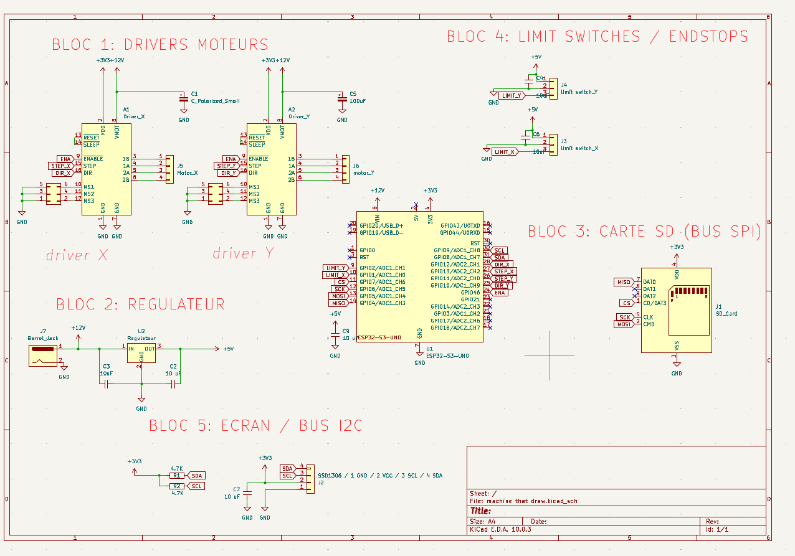
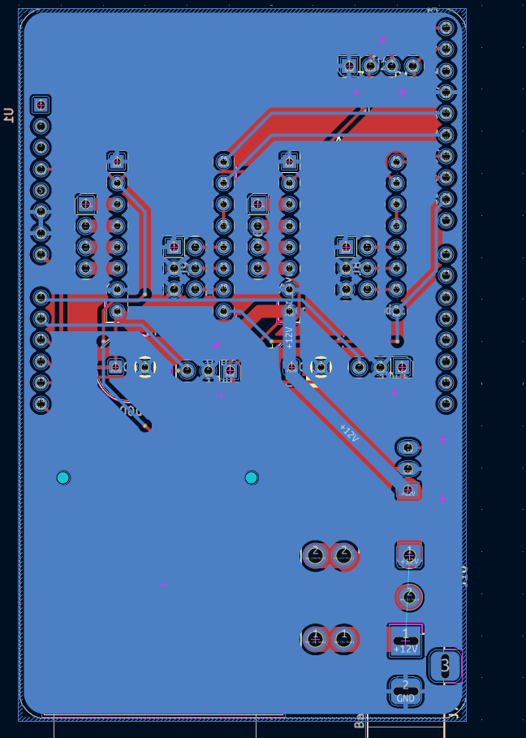
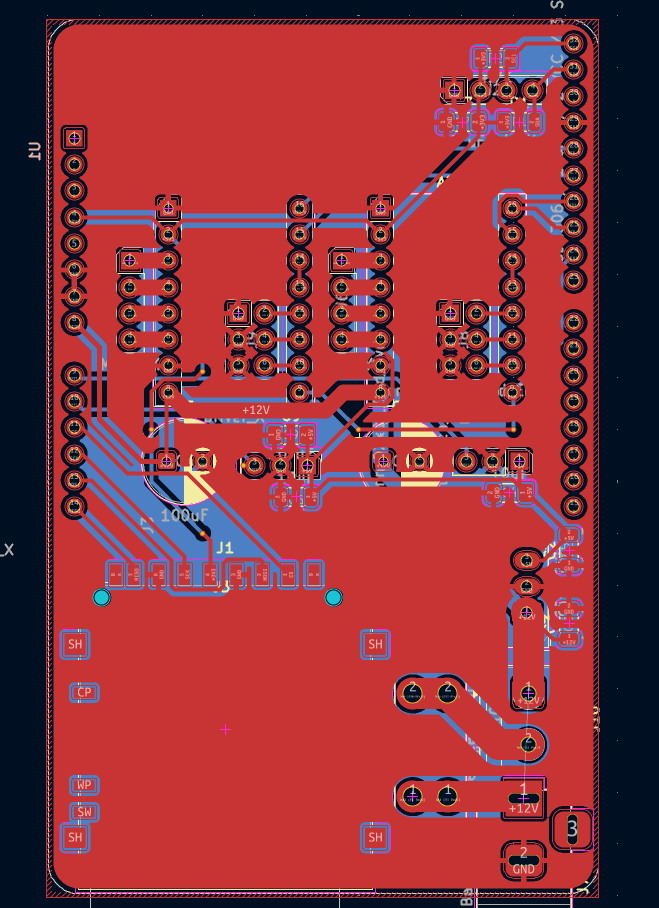

# Conception Mécanique
Pour réaliser ce projet, nous avons utilisé le logiciel Onshape, qui nous a permis de modéliser les différentes pièces de la machine. Nous nous sommes inspirées de plusieurs vidéos YouTube documentant l’assemblage de machines à dessin cartésiennes.

Notre machine étant contrainte de se déplacer sur un support matriciel, nous l’avons adaptée en ajoutant des pieds afin de surélever le support.

Nous avons modélisé chaque pièce en tenant compte de nos contraintes : un temps limité, des dimensions spécifiques et le déplacement sur le support.

{: .warning}
>Notre premier défi a été de fixer l’ensemble de la structure sur un roulement se déplaçant sur le rail. Nous avons donc conçu une pièce supportant le reste de la structure, qui se positionne au-dessus et en dessous du rail.

<iframe 
  title="Pièce Support Rail" 
  width="100%" 
  height="450" 
  src="https://sketchfab.com/models/c3bd720f2f17474a802f625dfadcba9a/embed?autostart=1" 
  frameborder="0" 
  allowfullscreen 
  allow="autoplay; fullscreen; xr-spatial-tracking">
</iframe>

{: .warning}
>Pour les fins de course, nous avons créé des supports délimitant les limites de la machine.

<iframe 
  title="Limit Switch" 
  width="100%" 
  height="450" 
  src="https://sketchfab.com/models/64b3bf473aac44a893713e567cd0b574/embed?autostart=1" 
  frameborder="0" 
  allowfullscreen 
  allow="autoplay; fullscreen; xr-spatial-tracking">
</iframe>

{: .warning}
>Au niveau de la structure, nous avons placé une plateforme au-dessus du support se déplaçant sur le rail. Cette pièce permet d’y fixer les servomoteurs et de maintenir le deuxième axe.

<iframe 
  title="Plateau Support" 
  width="100%" 
  height="450" 
  src="https://sketchfab.com/models/66eb4d2224924e108db3451a91009c64/embed?autostart=1" 
  frameborder="0" 
  allowfullscreen 
  allow="autoplay; fullscreen; xr-spatial-tracking">
</iframe>

{: .warning}
>À l’extrémité de l’axe, nous avons installé un support pour les tiges métalliques fournies, auquel nous avons fixé une roulette en dessous afin de soutenir la structure.

<iframe 
  title="Extrémité" 
  width="100%" 
  height="450" 
  src="https://sketchfab.com/models/32937586b030452e9d19457b4aa62bd4/embed?autostart=1" 
  frameborder="0" 
  allowfullscreen 
  allow="autoplay; fullscreen; xr-spatial-tracking">
</iframe>

{: .warning}
>Cette roulette circule sur une bande prévue à cet effet, fixée sur une planche permettant de positionner le papier et de le maintenir en place grâce à quatre coins.

<iframe 
  title="Calle Papier" 
  width="100%" 
  height="450" 
  src="https://sketchfab.com/models/19bd36e002fb4ff8b51de0e3bc6dd871/embed?autostart=1" 
  frameborder="0" 
  allowfullscreen 
  allow="autoplay; fullscreen; xr-spatial-tracking">
</iframe>

{: .warning}
>En ce qui concerne le support de stylo, nous avons mis en place un système de soulèvement du stylo grâce à un servomoteur et un palonnier qui soulève la pièce support. L’ensemble est maintenu par une grande pièce circulant sur les barres métalliques. Nous avons également installé des bloqueurs de courroie.

<iframe 
  title="Axe Crayon" 
  width="100%" 
  height="450" 
  src="https://sketchfab.com/models/81c1ab90797745b7b349d55657088828/embed?autostart=1" 
  frameborder="0" 
  allowfullscreen 
  allow="autoplay; fullscreen; xr-spatial-tracking">
</iframe>

#Conception Électronique

Pour ce qui est de la carte électronique, on a fait le choix d'une architecture modulaire en 5 blocs fonctionnels autour d'un ESP32-S3, qui offre suffisamment de GPIOs et une puissance de calcul adaptée au temps réel. Les drivers moteurs A4988 gèrent de façon autonome l'alimentation des moteurs pas-à-pas, ce qui décharge le microcontrôleur. Le PCB est réalisé en double couche avec un plan de masse continu pour minimiser le bruit électrique.

★ BLOC 1 : Drivers Moteurs
Ce que c'est : Deux drivers de moteurs pas-à-pas, un pour l'axe X, un pour l'axe Y.
Pourquoi ce choix :

- Les moteurs pas-à-pas permettent un positionnement précis sans encodeur, ce qui est idéal pour un plotter
- Les drivers A4988/DRV8825 sont des solutions intégrées : ils gèrent le courant dans les bobines, le microstepping (découpage du pas pour plus de précision), et la protection thermique
- Les condensateurs de découplage (C1, C5) sur l'alimentation VMOT filtrent les pics de tension quand les moteurs commutent, c'est une bonne pratique indispensable.

★ BLOC 2 : Régulateur d'alimentation
Ce que c'est : Conversion 12V → 5V via un régulateur à découpage (U2).
Pourquoi ce choix :

- L'alimentation principale est +12V (barrel jack J7) pour les moteurs
- Le reste du circuit (ESP32, écran, SD) fonctionne en 3.3V ou 5V → il faut réguler
- Les condensateurs C2 et C3 (10µF) stabilisent la tension en entrée et sortie du régulateur
- Un régulateur à découpage est bien plus efficace qu'un linéaire : avec 7V d'écart entre entrée et sortie, un linéaire aurait beaucoup chauffé et gaspillé de l'énergie

Point à mentionner : Le régulateur à découpage fonctionne en commutant très rapidement pour transférer l'énergie, ce qui minimise les pertes thermiques. C'est le choix idéal ici.

★ BLOC 3 : Carte SD (Bus SPI)
Ce que c'est : Interface pour lire les fichiers G-code ou trajectoires depuis une carte SD.
Pourquoi SPI :

- Le protocole SPI (4 fils : MISO, MOSI, SCK, CS) est rapide et nativement supporté par l'ESP32
- Permet de lire les fichiers de dessin sans connexion PC

Signaux : MISO, MOSI, SCK (horloge), CS (chip select pour activer la carte)

★ BLOC 4 : Limit Switches / Endstops
Ce que c'est : Deux interrupteurs de fin de course, un par axe (X et Y).
Pourquoi c'est indispensable :

- Permettent le homing : la machine se recale à une position de référence au démarrage
- Protègent mécaniquement la machine contre les dépassements de course
- Les condensateurs C4/C6 (100nF) font un filtre anti-rebond hardware, évite les fausses détections dues aux rebonds mécaniques du contact

★ BLOC 5 : Écran / Bus I2C
Ce que c'est : Connecteur pour un écran OLED SSD1306 (très courant, petit écran 128x64).
Pourquoi I2C :

- Seulement 2 fils (SDA + SCL) → économise des GPIOs
- Suffisant pour un écran d'interface simple
- Les résistances pull-up R1/R2 (4.7kΩ) sont obligatoires sur un bus I2C, elles maintiennent les lignes à l'état haut au repos

★ Le PCB :

Face avant :
Le plan de masse en cuivre rouge couvre toute la carte, ce qui réduit les interférences et facilite le routage du GND. On distingue les empreintes des drivers, de l'ESP32, du régulateur et des connecteurs.

Face arrière :
Les pistes rouges représentent les connexions sur la face avant. Le routage en deux couches séparées permet de faire se croiser des pistes sans risque de court-circuit.

Choix de conception PCB à mentionner :
Les condensateurs de découplage ont été placés au plus près des alimentations des ICs, ce qui est une bonne pratique en conception PCB. Les connecteurs moteurs (J5/J6) sont positionnés en bordure de carte pour faciliter le câblage. Enfin, le plan de masse continu sur toute la surface permet de réduire le bruit sur les signaux de commande.
