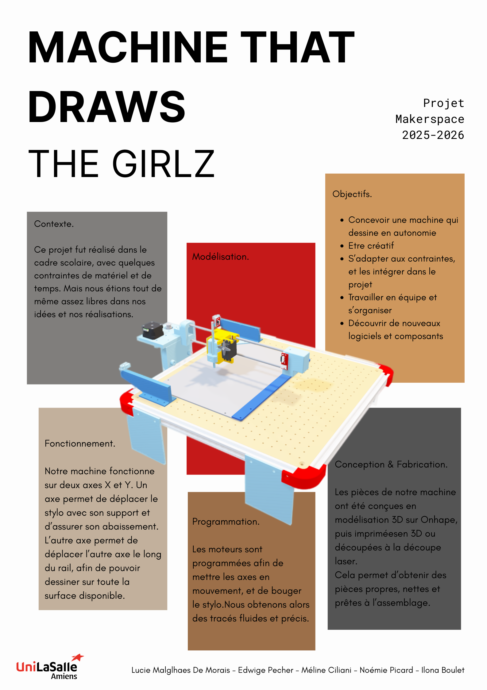

# Projet Machine that draws

---

{: .warning}
>Bienvenue dans la documentation du projet "Machine that draws". Ce site a pour but de fournir toutes les informations nécessaires pour comprendre, utiliser et reproduire efficacement notre projet.

[Notre projet sur Onshape]((https://cad.onshape.com/documents/8c814b0ab65beaae0eeaa526/w/d013e59062569ffd4bf796fa/e/a597e80902563e66ad237642)){: .btn .btn-primary .fs-5 .mb-4 .mb-md-0 .mr-2 }
[Notre repo GitHub](https://github.com/Makerspace-Amiens-2025-26/MachineThatDraws-Groupe01.git){: .btn .fs-5 .mb-4 .mb-md-0 }

<iframe height="600" width="100%" src="https://modelembedder.net/embed?did=8c814b0ab65beaae0eeaa526&wvm=v&wvmid=54c82319ee3d9ecce02ef079&eid=a597e80902563e66ad237642&elementType=ASSEMBLY" frameborder="0"></iframe>

---

## À propos du Projet

Ce projet s'inscrit dans notre parcours scolaire, nous sommes un groupe de 5 étudiantes à Unilasalle Amiens. Il a pour but de nous former à la création et l'utilisation d'une machine à commande numérique. Il vise à concevoir une architecture système permettant de transformer une image numérique en un dessin physique, en passant par sa vectorisation et la génération de ses coordonnées G-code.

---

## Poster

---

## Vidéo

(à cause du trop gros volume de notre vidéo, nous ne pouvons pas l'afficher sur ce site)

<video src="images/vidéo_présentation.mp4" controls title="Title"  style="width: 100%;"></video>

---
